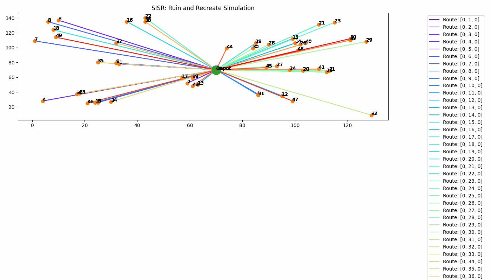

# SISR-for-VRP

Reimplementation of Slack Induced by String Removals (SISR) algorithm for Vehicle Routing Problem (VRP)

## SISR's simulation using dummy data



## How to Run

1. First clone this repo by running the following command from your terminal

```
    git clone https://github.com/rinogrego/SISR-for-VRP
```

2. Go to the folder that contains the cloned repository

```text
    cd SISR-for-VRP
```

3. Initiate a virtual environment

```text
    python -m venv venv
```

4. Activate the virtual environment

```text
    venv\\scripts\\activate
```

5. Install the necessary libraries

```text
    pip install -r requirements.txt
```

6. You can run the following program using the following command

```python
    python SISR.py
```

7. You can implement various parameters: method objective, number of iterations, and maximum hour of working per vehicle, as follow

```text
    python SISR.py --obj "min-sum" --n_iter 1000 --max_hour_per_vehicle 12
```

```text
    python SISR.py --obj "min-max" --n_iter 1000 --max_hour_per_vehicle 12
```

## Parameter Explanation

| Parameters | Description |
| -- | -- |
| obj | define objective function for the method to optimize |
| n_iter | number of iterations |
| max_hour_per_vehicle | define the maximum hour for each vehicle to be able to work |

**Why is there a max hour per vehicle parameter?**

To control the algorithm. Initially, SISR was developed to optimize the reduction of vehicle usage even if it will costs more. Hence to counteract that, maximum hour of working for each vehicle is implemented to prevent the reduction of vehicle utilization.

## Note

- parameter `fleet_gap` masih belum dimengerti
- implementasi multi-trip basic bikin c bisa dimasukkin seenaknya sehingga 1 vehicle bisa makan semua rute dan itu akan dicek
  - idea: mungkin bisa dikasih batasan satu vehicle berapa customer, tapi secara abstrak/teori, kalau ada N customers, mengunjungi N-1 customers bisa aja lebih cepet dibanding datengin 1 customer yang terakhir
- implementasi multi-trip basic bikin time_progress bisa > 24 jam (LMFAO)
  - ideas: mungkin di-limit kalo >= 24 jam berarti break
- implementasi limit >= 24 jam malah bikin algoritma nemu 1 rute vehicle aja. gak tau masalah-nya dimana. mungkin karena main objective-nya fleet minimization dan bukan cost minimization
  - ideas:
    - implementasi >= 12 jam --> dapet 2 rute vehicle instead of 1
    - implementasi >= 8 jam --> dapet 3 rute vehicle instead of 2
- tapi ya... gak nolong ngefix core problem-nya
- metode SISR memiliki objective mereduce penggunaan vehicle meski cost-nya nambah
- adaptasi-nya dengan implement max_hour_vehicle
- drawing route dengan multi-trip masih jelek

## To-do

- implement route visualization that consider multi-trip (optional)
- implement vehicle reduction prevention in Ruin method
